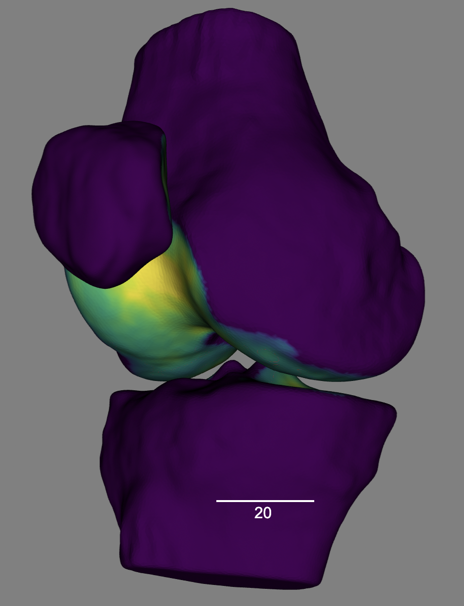

# pyMSKT (Musculoskeletal Toolkit)
<br>
<br>
|[Documentation](https://anthonygattiphd.com/pymskt/)|

pyMSKT is an open-source library for performing quantitative analyses of the musculoskeletal system. It enables creation of surface meshes of musculoskeletal anatomy and then processes these meshes to get quantitative outcomes and visualizatons, like for cartilage thickness.  

<p align="center">

</p>

# Installation

This repository depends on [`pyfocusr`](https://github.com/gattia/pyfocusr) and [`cycpd`](https://github.com/gattia/cycpd) for registration. All dependencies for these other libraries are included in the requirements for this repository - instructions for installing are included below. 

### Conda / pip (Recommended)
```bash
    # clone repository
    git clone https://github.com/gattia/pymskt.git
    
    # move into directory
    cd pymskt
    
    # CREATE ENVIRONMENT:
    conda env create -n mskt
    conda activate mskt

    # INSTALLING DEPENDENCIES
    # Recommend pip becuase cycpd and pyfocusr are available on pypi (but not conda)
    pip install -r requirements.txt

    # IF USING PIP
    pip install .
```

### Conda only install (not-recommended)

1. Clone this repository & install dependencies: <br>
    ```bash
    # clone repository
    git clone https://github.com/gattia/pymskt.git
    
    # move into directory
    cd pymskt
    
    # CREATE ENVIRONMENT:
    conda env create -n mskt
    conda activate mskt

    # Install all available requirements
    conda install --file requirements-conda.txt # pip (below) can alternatively be used to install dependencies in conda env
    
    # Return to root dir
    cd ..
    
    ```

2. Clone cycpd & install: (ONLY NEEDED FOR CONDA INSTALL)<br>
    ```bash
    git clone https://github.com/gattia/cycpd.git
    cd cycpd
    pip install .
    cd ..
    ```
3. Clone pyfocusr & install: (ONLY NEEDED FOR CONDA INSTALL)<br>
    ```bash
    git clone https://github.com/gattia/pyfocusr.git
    cd pyfocusr
    pip install .
    cd ..
    ```
4. Install pymskt: (ONLY NEEDED FOR CONDA INSTALL)<br>
    ```bash
    cd pymskt
    pip install .
    ```


### To install itkwidgets (for visualization): 
If you are using jupyterlab instead of jupyter notebook, you also need to install an extension: 
```
jupyter labextension install @jupyter-widgets/jupyterlab-manager jupyter-matplotlib jupyterlab-datawidgets itkwidgets
```

# Examples
There are jupyter notebook examples in the directory `/examples`

pyMSKT allows you to easily create bone meshes and attribute cartilage to the bone for calculating quantitative outcomes. 

```python
femur = BoneMesh(path_seg_image=location_seg,  # path to the segmentation image being used.
                 label_idx=5,                  # what is the label of this bone.
                 list_cartilage_labels=[1]) # labels for cartilage associted with bone.   
# Create the bone mesh
femur.create_mesh()
# Calcualte cartialge thickness for the cartialge meshes associated with the bone
femur.calc_cartilage_thickness()
femur.save_mesh(os.path.expanduser'~/Downloads/femur.vtk')
```
The saved file can be viewed in many mesh viewers such as [3D Slicer](https://www.slicer.org/) or [Paraview](https://www.paraview.org/). Or, better yet they can be viewed in your jupyter notebook using [itkwidgets](https://pypi.org/project/itkwidgets/): 
```python
from itkwidgets import view

view(geometries=[femur.mesh])
```


After creating the above mesh, creating cartilage subregions & an anatomical coordinate
system is as simple as: 

```python
# Load in full seg image
seg_image = sitk.ReadImage(location_seg)
# break into sub regions. (weightbearing / trochlea / posterior condyles)
seg_image = mskt.image.cartilage_processing.get_knee_segmentation_with_femur_subregions(seg_image)

# assign femoral condyle cartilage sub regions to femur 
femur.seg_image = seg_image
femur.list_cartilage_labels=[11, 12, 13, 14, 15]
femur.assign_cartilage_regions()

# use cartilage regions to fit cylinder to condyles and create anatomic coordinate system 
femur_acs = FemurACS(femur, cart_label=(11, 12, 13, 14, 15))
femur_acs.fit()
```

The resulting anatomical coorindate system can be used to create arrows & visualize the result: 

```python
AP_arrow = get_arrow(femur_acs.ap_axis, origin=femur_acs.origin )
IS_arrow = get_arrow(femur_acs.is_axis, origin=femur_acs.origin)
ML_arrow = get_arrow(femur_acs.ml_axis, origin=femur_acs.origin)

view(geometries=[femur.mesh, AP_arrow, IS_arrow, ML_arrow])
```
|*Anatomical Coordinate System - Cartilage Thickness* | *Anatomical Coordinate System - Cartilage Subregions* |
|:---:       |:---:        |
|   |  |


An example of how the cartilage thickness values are computed:


# Development / Contributing
General information for contributing can be found [here](https://github.com/gattia/pymskt/blob/main/CONTRIBUTING.md)

## Tests
- Running tests requires pytest (`conda install pytest` or `pip install pytest`)
- Run tests using `pytest` or `make test` in the home directory. 

## Coverage
- Coverage results/info requires `coverage` (`conda install coverage` or `pip install coverage`)
- Can get coverage statistics by running: 
    - `coverage run -m pytest`
    or if using make: 
    - `make coverage`

## Notes for development
- When updating cython code, it is not re-built when we re-install using the basic `python setup.py install`. Therefore we force it to do this: 
    - `python setup.py build_ext -i --force`          

### Tests
If you add a new function, or functionality to `pymskt` please add appropriate tests as well. 
The tests are located in `/testing` and are organized as: 
`/testing/[pymskt_submodule]/[python_filename_being_tested]/[name_of_function_being_tested]_test.py`

The tests use `pytest`. If you are not familiar with `pytest` a brief example is provided [here](https://docs.pytest.org/en/6.2.x/getting-started.html). 

Currently, 37 tests are being skipped for one of 2 (maybe 3) reasons. 1. They arent implemented yet and they are a placeholder. 2. They rely on a function that has small machine-to-machine differences so they dont pass or 3. A breaking change occured since result meshes were last saved. If you want to help but dont know how or where to start, filling in / fixing these tests would be a great place to start! And greatly appreciated.

## Code of Conduct
We have adopted the code of conduct defined by the [Contributor Covenant](https://www.contributor-covenant.org) to clarify expected behavior in our community. For more information see the [Code of Conduct](https://github.com/gattia/pymskt/blob/main/CODE_OF_CONDUCT.md).